# pi-graph

[English](README.en.md) | **中文**

`pi-graph` 是面向 [Pi agent harness](https://github.com/earendil-works/pi) 的状态图扩展。它借鉴 [LangGraph](https://github.com/langchain-ai/langgraph) 的低层编排理念，用显式 state、nodes、edges、reducers、supersteps、checkpoint 和 interrupt 组织 Pi agent 工作流。

当前版本：**0.0.1**。

`pi-graph` 不再把所有 agent node 强制为一次性隔离上下文。每个 agent 节点可按职责选择三种上下文语义：

| 模式 | 跨节点记忆 | 持久化位置 | 典型用途 |
|---|---|---|---|
| `isolated` | 只通过 graph state / 文件传递 | 无私有 Pi session | 独立 reviewer、并行研究、一次性专家 |
| `thread` | 同一 `threadKey` 复用私有 Pi session | Pi JSONL session + checkpoint thread metadata | 实现—审查—修复循环、持续研究员 |
| `shared` | role-tagged messages 写入 graph state | graph checkpoint | ReAct 风格连续对话、显式可审计 handoff |

未声明 `context` 的旧图仍按 `isolated` 运行，保持 `schemaVersion: 1` 向后兼容。

设计遵循 [Graph Engineering Guide (2026)](https://www.aibuilderclub.com/blog/graph-engineering-guide-2026) 的核心约束：先尝试单 agent loop；只有在任务确实需要专业分工、并行 fan-out/fan-in、不同模型或工具、独立 reviewer、可审计路由、持久角色记忆或故障隔离时才使用图。

## 已实现

- 显式 JSON shared state、节点、静态边和条件边
- LangGraph/Pregel 风格 bulk-synchronous superstep
- 并行 fan-out、多源 barrier fan-in、条件分支和循环回边
- `agent`、`set`、`human` 三类节点
- `isolated`、`thread`、`shared` 三种 agent context mode
- 每节点独立 model、thinking、tools、cwd、资源继承和预算
- 原子 state commit；并行写冲突必须声明 reducer
- shared message channel 自动使用 `concat` reducer
- thread session 的 durable identity、恢复和并发保护
- 节点重试、幂等性诊断、失败隔离和错误路由
- durable checkpoint、失败恢复、人工 interrupt/resume
- graph/node 级 step、node-run、并发、token、cost、timeout、output 和 state-size 硬上限
- 项目图 trust gate、mutating-tool confirmation、非交互执行策略
- 图可视化：`/pi-graph visualize` 把任意已发现图渲染成 Mermaid 流程图
- Pi tools：`pi_graph_run`、`pi_graph_resume`、`pi_graph_inspect`
- Pi command：`/pi-graph`

## 安装

从本地目录安装：

```bash
pi install ./pi-graph
```

开发时直接加载：

```bash
pi --no-extensions -e ./pi-graph/extensions/pi-graph.ts
```

Pi package manifest 已在 `package.json` 的 `pi.extensions` 中声明。运行时只依赖 Pi 提供的 `@earendil-works/pi-coding-agent` 与 `typebox` peer packages。

## 5 分钟开始

安装示例图：

```bash
mkdir -p ~/.pi/agent/graphs
cp ./pi-graph/examples/research-review.json ~/.pi/agent/graphs/
cp ./pi-graph/examples/shared-handoff.json ~/.pi/agent/graphs/
```

启动 Pi 后：

```text
/pi-graph list
/pi-graph validate research-review
/pi-graph run research-review 为这个仓库设计一个安全的缓存失效方案
```

人工节点暂停后会返回 `runId`：

```text
/pi-graph resume <runId> true
```

模型也可以调用：

```json
{
  "graph": "research-review",
  "task": "为这个仓库设计一个安全的缓存失效方案",
  "checkpoint": true
}
```

## Agent 上下文模型

### `isolated`：独立上下文

```json
{
  "type": "agent",
  "purpose": "reviewer",
  "prompt": "Review {{draft}}",
  "readOnly": true,
  "context": { "mode": "isolated" },
  "output": "review"
}
```

每次调用启动新的无会话 Pi 子进程：

```text
pi --mode json -p --no-session ...
```

节点不会继承其他节点的 Pi 消息历史。跨节点信息必须通过：

1. graph state，例如 `draft`、`review.requiredChanges`
2. 共享工作目录中的真实产物，例如代码和测试输出
3. Pi context files，例如稳定的 `AGENTS.md`

适合独立 reviewer、并行研究分支、一次性专家和需要强故障边界的节点。

### `thread`：私有持久 Pi session

```json
{
  "type": "agent",
  "prompt": "Implement {{input.task}}. Prior review: {{review}}",
  "context": {
    "mode": "thread",
    "threadKey": "coder"
  },
  "output": "implementation"
}
```

具有相同 `threadKey` 的节点顺序复用同一 Pi session：

```text
planner(threadKey=coder)
  → implementer(threadKey=coder)
  → isolated reviewer
  → implementer(threadKey=coder)
```

第二次进入 `implementer` 时，Pi 能看到 `coder` 私有 session 的既有消息与工具工作记忆；当前 graph state 仍是权威输入，节点 prompt 应继续显式引用计划、审查结果和控制状态。

Thread metadata 保存在 graph checkpoint，私有 Pi session 默认位于：

```text
~/.pi/agent/pi-graph/threads/<runId>/<sessionId>.jsonl
```

约束：

- 未指定 `threadKey` 时默认使用 node id。
- 同一 `threadKey` 不能在一个 superstep 中并发运行。
- 共享同一 `threadKey` 的节点必须使用相同 `cwd`。
- 私有 session 文件丢失时，恢复会失败；运行器不会静默重置角色记忆。
- Thread retry 会在同一 session 中再次追加 prompt；编译器因此产生 `THREAD_RETRY_APPENDS_HISTORY` warning。生产图通常应将 thread 节点 `maxAttempts` 设为 `1`，由 graph loop 负责修复迭代。

### `shared`：显式共享消息通道

```json
{
  "type": "agent",
  "prompt": "Continue the analysis for {{input.task}}",
  "context": {
    "mode": "shared",
    "messagesPath": "conversation.messages",
    "maxMessages": 32,
    "maxPromptBytes": 65536
  },
  "output": "analysis"
}
```

成功节点会把当前 user instruction、assistant messages 和 tool results 追加到指定 state path：

```json
{
  "role": "assistant",
  "content": "...",
  "nodeId": "analyst",
  "name": null,
  "createdAt": "2026-07-21T12:00:00.000Z"
}
```

`messagesPath` 自动获得 `concat` reducer，因此并行 shared 节点可把各自消息确定性追加到同一通道。显式配置其他 reducer 会被拒绝。

当前实现将最近的 role-tagged messages 作为**显式 transcript projection**注入新的 Pi 子进程，而不是让多个节点共享一个隐藏 Pi session。这样 messages 是普通 graph state：可检查、可裁剪、可 checkpoint、可由 reducer 合并。默认最多注入最近 32 条消息、64 KiB UTF-8 文本；可通过 `maxMessages` 和 `maxPromptBytes` 收紧。

只有成功节点的 shared messages 才随 step 原子提交。失败或中断节点不会把半完成消息写入 graph state。

### 如何选择

```text
同一职责需要跨循环保持工作记忆    → thread
多个节点需要共享可审计对话历史    → shared
节点必须独立判断或并行隔离        → isolated
普通确定性转换                    → set
需要批准、选择或补充输入          → human
```

推荐组合：

```text
planner/thread ─→ implementer/thread ─→ reviewer/isolated
                         ↑                    │
                         └──── required changes ────┘
```

或者：

```text
analyst/shared → writer/shared → reviewer/isolated
```

## 图发现目录

用户图：

```text
~/.pi/agent/graphs/*.json
```

项目图：

```text
<project>/.pi/graphs/*.json
```

`scope: "both"` 时项目图按 `name` 覆盖同名用户图。项目图只在 Pi 已信任该项目时发现；交互模式默认还会显示图级确认。工具只接受已发现的图名，不接受任意文件路径。

## 最小图

```json
{
  "schemaVersion": 1,
  "name": "research-review",
  "entry": "researcher",
  "nodes": {
    "researcher": {
      "type": "agent",
      "prompt": "Research {{input.task}}",
      "readOnly": true,
      "context": { "mode": "isolated" },
      "output": "notes"
    },
    "writer": {
      "type": "agent",
      "prompt": "Write from {{notes}}. Prior review: {{review}}",
      "readOnly": true,
      "context": { "mode": "thread", "threadKey": "writer" },
      "output": "draft"
    },
    "reviewer": {
      "type": "agent",
      "purpose": "reviewer",
      "prompt": "Review {{draft}} and return {\"approved\": boolean, \"issues\": string[]}",
      "readOnly": true,
      "context": { "mode": "isolated" },
      "output": "review",
      "response": { "format": "json" }
    }
  },
  "edges": [
    { "from": "researcher", "to": "writer" },
    { "from": "writer", "to": "reviewer" }
  ],
  "routes": [
    {
      "from": "reviewer",
      "cases": [
        {
          "when": { "path": "review.approved", "op": "eq", "value": true },
          "to": "__end__"
        }
      ],
      "default": "writer"
    }
  ],
  "limits": {
    "maxSteps": 8,
    "maxNodeRuns": 12,
    "maxConcurrency": 2,
    "maxCostUsd": 3,
    "maxTokens": 300000,
    "timeoutMs": 1200000,
    "maxStateBytes": 1048576
  }
}
```

完整字段见 [`docs/SCHEMA.md`](docs/SCHEMA.md)。

## Graph 可视化

`/pi-graph visualize <graph>` 把任意已发现图渲染成 Mermaid `flowchart LR` 并直接在 Pi TUI 中显示。结构直接来自图定义本身；即便存在编译错误也会先渲染，便于排查控制流问题。

```text
/pi-graph visualize research-review
```

输出包含一个摘要 header（节点 / edge / route 计数，或编译错误数）和一个 Mermaid 代码块。下面的图由同一渲染逻辑（`generateMermaid`）通过 `npm run render:graphs` 预渲染成 SVG 并提交进仓库，因此在 GitHub、npm 和任何不支持 Mermaid 的预览器里都能直接看到。

### 节点形状

| 类型 | 形状 | Mermaid 语法 |
|---|---|---|
| `agent` | stadium（圆角矩形） | `id([id])` |
| `set` | subroutine（双边框矩形） | `id[[id]]` |
| `human` | hexagon（六边形） | `id{id}` |
| `__end__` | circle（圆形） | `__end__((end))` |

入口节点（`entry` 中真实存在的节点 id）用绿色加粗边框标记：`classDef entry stroke:#2a2,stroke-width:3px;`。

### 边与路由

- 静态 edge：实线箭头 `a --> b`。`from`/`to` 为数组时展开成所有组合，因此 fan-out 和 barrier fan-in 在图上表现为多条平行箭头。
- 条件 route：虚线箭头带条件标签 `a -. "label" .-> b`；未命中的 `default` 分支标注为 `else`。
- 条件标签由 condition DSL 生成：`all`/`any`/`not` 渲染为 `∧`/`∨`/`¬`，比较符映射成 `==`、`!=`、`>`、`≥`、`<`、`≤` 等；标签中的 `"` 会被替换成 `'` 以保持 Mermaid 语法合法。

### 示例：并行研究 + thread writer + 独立 reviewer

`/pi-graph visualize research-review` 渲染为：



两个入口节点（并行 isolated 研究）在 writer 处 barrier 汇合；reviewer 的条件 route 在达标时走向 `__end__`，否则带 `else` 标签回到 writer 形成修订回环。

### 示例：并行 fan-out + barrier 锦标赛

`/pi-graph visualize idea-tournament` 展示三条并行 ideator 分支如何通过同一 edge 汇聚到 barrier 节点 judge：



### 其余示例图

`coding-review`（thread coder + 独立 reviewer + human approval，两层条件回环）：



`shared-handoff`（显式 shared message channel + isolated reviewer 修订回环）：


`science-research`（人工 scope 门控 + 条件精修回环、并行 fan-out + barrier、由冲突触发的 shared 对抗辩论、带嵌套条件路由的 thread 集成、确定性归档 set 节点、分支 error-continue）：



`science-research-auto`（`science-research` 的全自动变体：用 isolated agent 评审节点 `scope_review` 取代人工 scope 门控，由 agent 自行判断 approve/refine；其余机制不变——并行 fan-out + barrier、shared 对抗辩论、thread 集成 + 嵌套条件路由、精修回环。适合 headless / CI 等无人工介入场景）：



### 重新生成

编辑 `examples/*.json` 后重跑脚本即可刷新所有 SVG（调用与 `/pi-graph visualize` 相同的 `generateMermaid`，保证与 TUI 输出一致）：

```bash
npm run render:graphs
```

`docs/images/*.svg` 已提交进仓库，读者无需运行脚本即可看到图；`@mermaid-js/mermaid-cli` 仅为 devDependency，不进入运行时。

## State 与 reducers

运行状态是 JSON object。初始输入位于 `state.input`；图的 `initialState` 与调用输入深合并。节点通过模板 `{{path.to.value}}` 和可选 `reads` 读取状态，通过 `output`、shared message channel 或 `set.assign` 写状态。

同一 superstep 内所有节点读取同一个不可变快照。节点完成后，写集合一次性提交。两个并行节点写同一路径时，如果没有 reducer，运行会失败；父路径和子路径在同一 superstep 内同时写入也会被拒绝。

支持：

- `replace`
- `append`
- `concat`
- `merge`
- `sum`
- `min`
- `max`

## Edges、并行与循环

普通 edge：

```json
{ "from": "a", "to": "b" }
```

fan-out：

```json
{ "from": "a", "to": ["b", "c"] }
```

barrier fan-in：

```json
{ "from": ["b", "c"], "to": "join" }
```

条件 route：

```json
{
  "from": "reviewer",
  "cases": [
    { "when": { "path": "review.approved", "op": "eq", "value": true }, "to": "__end__" }
  ],
  "default": "writer"
}
```

条件 DSL 不使用 `eval`。支持 `eq`、`ne`、`gt`、`gte`、`lt`、`lte`、`exists`、`truthy`、`includes`、`matches`，以及 `all`、`any`、`not`。

## Durable execution

Graph checkpoint 默认写入：

```text
~/.pi/agent/pi-graph/runs/<runId>.json
```

每个 superstep 开始前、每个成功节点完成后、step commit 后以及 interrupt/failure/end 时原子写入。并行 step 中已成功节点保存在 `inFlight.completed`；恢复只重新执行 unresolved 节点。

Checkpoint 保存 graph hash。定义变化后默认拒绝恢复；`forceGraphVersion` 只应用于已经人工检查 state 兼容性和 side-effect 幂等性的情况。

Thread 模式额外形成双层持久化：

```text
graph checkpoint
  ├─ state / routing / usage / inFlight
  └─ threadKey → stable Pi sessionId

Pi session JSONL
  └─ 该角色的私有 message/tool history
```

## Graph-engineering 约束

1. **Loop first**：单节点图产生 warning；简单任务应使用普通 Pi loop。
2. **Real specialties**：节点应代表真实职责边界，而不是把可内联步骤伪装成角色。
3. **Explicit edges/state**：控制流、输入依赖、输出路径和 reducer 可审阅。
4. **Choose memory deliberately**：`isolated`、`thread`、`shared` 必须按角色语义选择。
5. **Reviewer with teeth**：`purpose: "reviewer"` 未只读会 warning；非 isolated reviewer 也会 warning。
6. **Failure isolation**：节点成功前不提交 graph state；支持 retry、continue 和 error route。
7. **Hard bounds**：step、node runs、并发、token、cost、timeout、output 和 state 均有硬限制。
8. **No hidden recursive graphing**：child Pi 禁用三个 pi-graph tools。

## 失败与重试

默认失败停止图并保留 in-flight checkpoint：

```json
"onError": { "strategy": "fail" }
```

记录错误后继续：

```json
{
  "onError": {
    "strategy": "continue",
    "output": "errors.research"
  }
}
```

改走 fallback：

```json
{
  "onError": {
    "strategy": "route",
    "to": "fallback",
    "output": "errors.research"
  }
}
```

普通 isolated/shared 节点的重试：

```json
{
  "retry": {
    "maxAttempts": 3,
    "backoffMs": 500,
    "backoffMultiplier": 2
  },
  "idempotent": true
}
```

`idempotent: true` 是设计声明，不会自动使外部 side effects 幂等。Thread 模式重试还会复用已发生变化的私有 session，因此应额外谨慎。

## 安全模型

- 项目图只在 trusted project 中发现。
- 项目图默认需要交互确认。
- 包含 `bash/edit/write` 或未知 extension tools 的图默认需要额外确认。
- 非交互运行必须设置 `policy.allowNonInteractive: true`。
- 非交互 mutation 还必须设置 `policy.allowNonInteractiveMutations: true`。
- thread session 目录使用受限权限；丢失时拒绝静默重建已使用 session。
- 状态路径拒绝 `__proto__`、`prototype` 和 `constructor`。
- `readOnly` 是工具 allowlist，不是 OS sandbox。

## Pi 工具与命令

Tools：

- `pi_graph_run`：按图名执行，输入进入 `state.input`
- `pi_graph_resume`：按 `runId` 恢复；可提交人工输入
- `pi_graph_inspect`：查看 checkpoint、thread metadata 或近期运行

Command：

```text
/pi-graph list
/pi-graph validate [graph]
/pi-graph run <graph> [task or JSON object]
/pi-graph resume <runId> [value or JSON]
/pi-graph inspect [runId]
/pi-graph visualize <graph>
```

## 开发与验证

```bash
npm run check
npm test
npm run validate:examples
```

测试覆盖：

- 三种 context mode 与默认向后兼容
- shared message append、下一节点注入和隐式 reducer
- thread session 在 graph interrupt / process restart 后续接
- thread session 丢失时 fail closed
- reviewer isolation、thread cwd 和并发诊断
- 条件回环、fan-out/fan-in barrier
- 并行 state conflict 与 reducers
- retry、failure isolation、human interrupt/resume
- checkpoint persistence 与 Pi NDJSON event protocol
- TypeBox/Pi ExtensionAPI 严格类型检查

## 重要边界

- `shared` 是 role-tagged transcript 的显式 prompt projection，不是 provider-native message-array 注入，也不是多个节点共用一个 Pi session。
- `thread` 提供真实 Pi session 连续性，但 graph checkpoint 与 Pi JSONL 是两个持久化对象；备份、迁移和清理应同时处理。
- Checkpoint 提供 at-least-once 恢复语义，不保证外部 side effects exactly-once。
- Thread 节点可能在 Pi session 已追加历史、graph checkpoint 尚未更新时崩溃；恢复可重复当前 prompt。
- Cost/token limit 依赖 provider usage event；单个正在完成的 response 可能在终止前轻微越界。
- `readOnly` 不限制操作系统权限；高风险执行应使用容器或 OS sandbox。
- Barrier 以各 source 的 completion count 配对；同一 superstep 相同目标去重并执行一次。
- 图格式仍为 `schemaVersion: 1`。

## 示例与文档

- [`docs/SCHEMA.md`](docs/SCHEMA.md)：完整图格式和 context schema
- [`docs/ARCHITECTURE.md`](docs/ARCHITECTURE.md)：superstep、三层记忆、checkpoint 和故障语义
- [`examples/research-review.json`](examples/research-review.json)：并行 isolated research + thread writer + isolated reviewer
- [`examples/coding-review.json`](examples/coding-review.json)：shared coder thread + independent reviewer + human approval
- [`examples/shared-handoff.json`](examples/shared-handoff.json)：显式 shared message channel + isolated reviewer
- [`examples/idea-tournament.json`](examples/idea-tournament.json)：parallel fan-out（3 ideators）+ `append` reducer 聚合 + barrier judge 锦标赛
- [`examples/science-research.json`](examples/science-research.json)：复杂非线性科研图，用于压测图引擎——人工 scope 门控 + 精修回环、并行 fan-out + barrier、shared 对抗辩论（devil's advocate ↔ defender）、thread 集成 + 嵌套条件路由、`set` 归档节点、分支 `onError: continue`
- [`examples/science-research-auto.json`](examples/science-research-auto.json)：`science-research` 的全自动变体——用 isolated agent 评审 `scope_review` 取代人工门控，agent 自行判断 approve/refine，适合 headless 运行；保留并行 fan-out + barrier、shared 对抗辩论、thread 集成 + 嵌套条件路由、精修回环
